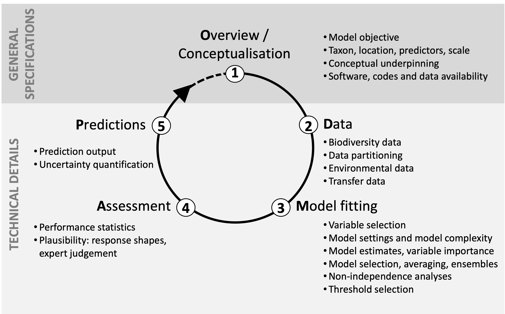

### **Introduction**

In this exercise, you will:

- Use [`ENMeval`](https://github.com/jamiemkass/ENMeval) to evaluate Maxent SDMs
- Get familiar with the [ODMAP (Overview, Data, Model, Assessment and Prediction) protocol)](https://odmap.wsl.ch/)

  
  
### **Getting Started**

- 

