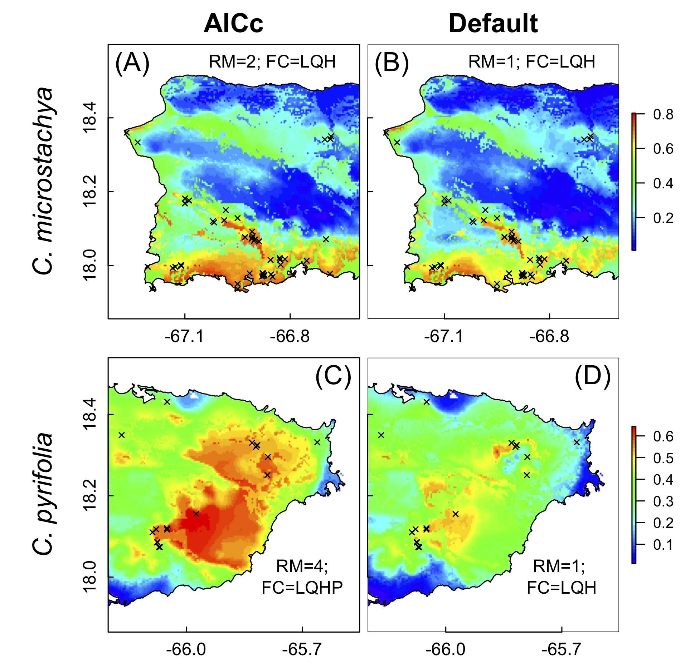

# **Intro to SDMs**

This short course will include:
 
- Lectures, readings, and discussions covering basic theory and concepts behind species distribution models (SDMs) and ecological niche models (ENMs)
- Practical experience in acquiring and cleaning species occurrence data, as well as designing, building and evaluating SDM and ENM using a variety of R packages
- Students will gain perspective on the potential applications, strengths, and limitations of SDMs/ENMs

Course participants should have a general understanding of R programming.  Participants are welcome (but not required) to join the course with their own data / project ideas.  A pre-course reading list and R exercise will be provided after course registration is completed.  Questions about the course should be sent to Bob Muscarella <robert.muscarella@ebc.uu.se>.

